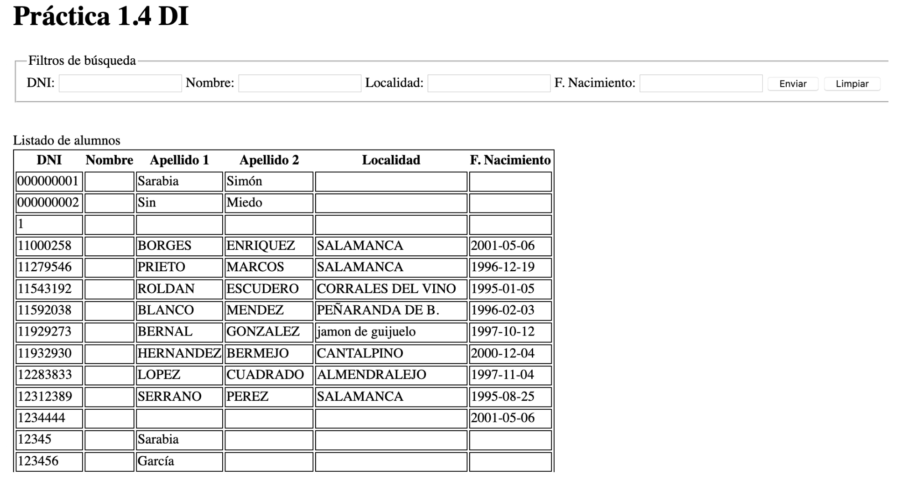
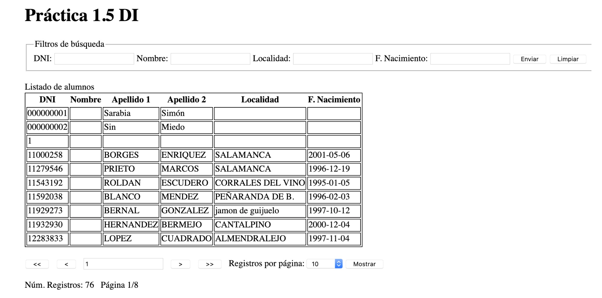

# PRÁCTICA 1. DESARROLLO DE INTERFACES

**Alumno**: Martín Antonio Córdoba Getar
**FPGS Desarrollo de Aplicaciones Multiplataforma. 2º Curso. Desarrollo de Interfaces**

## Procedimiento
El proyecto constará de varias prácticas pequeñas llamadas 1.1, 1.2, ... Para cada práctica
se creará una rama con el nombre practica_1.1, practica_1.2, practica_1.3,... en donde el número
de práctica variará en función de la práctica que estemos realizando. Una vez que hayamos
concluido la práctica se hará un MERGE con la rama MASTER, de tal manera que master siempre
contendrá lo último operativo. Esto no quita para que el alumno cree otras ramas a partir de
la de la práctica si lo considera necesario.

La corrección se hará desde Bitbucket, por lo que se ha de compartir el proyecto.

## Descripción 1.1
Hay que crear un index.php con el que montaremos una tabla dinámica, ayudándonos de los bucles de php,
con la estructura que muestra la tabla:

|Campo 1         |Campo 2         |Campo 3         |Campo 4         |
|----------------|----------------|----------------|----------------|
|Fila 1 Columna 1|Fila 1 Columna 2|Fila 1 Columna 3|Fila 1 Columna 4|

etc... hasta cuatro columnas y 6 filas

Para conseguirlo tendremos que anidar dos bucles, uno para las filas y otro para las columnas.
El número de filas y columnas dependerá de dos variables definidas en la cabecera del documento.

Aunque es un archivo php, su contenido será un documento HTML5 bien formado, con los scripts de
php necesarios insertados en el código.

## Descripción 1.2
Como continuación a la práctica 1.1, vamos a crear un pequeño formulario, en la parte superior de la
página, con dos campos: filas y columnas, y un botón de submit.

Según los datos que pongamos en las casillas, la tabla se redibujará al enviarlos. Tanto en la primera
carga como si los números que nos dan son menores a 1, se pondrán los valores por defecto 2x2.

## Descripción 1.3
En este ejercicio vamos a practicar las conexiones a BD mediante la clase PDO. Para ello vamos a crear
una conexión a la BD universidad y obtener el listado de alumnos de la BD mostrándolo en una tabla,
tal como muestra la imagen.

Lo vamos a hacer en el archivo index de la rama descartando todo el código que teníamos. Como siempre, el documento será un HTML5 bien formado aunque con extensión PHP para embeber nuestros scripts.

De las distintas formas de hacerlo que tenéis en el manual adjunto en moodle, vamos a realizarlo con el método "prepare" ya que aporta robustez, y en un cuanto a la forma de rellenar la tabla se deja a criterio del alumno.

Para no tener problemas con la codificación alfanumérica de la BD tendréis que forzar que la conexión a la BD se haga con UTF-8

## Descripción 1.4
Se seguirá el mismo procedimiento que con las prácticas anteriores, creando una nueva rama llamada práctica1.4.

En este ejercicio vamos a crear un formulario que permita el envío de datos para la realización de filtros, aplicados con ***where*** a la query, enviándolos tal como se hizo en la práctica 1.2.

Lo vamos a hacer en el archivo index completando lo realizado en la práctica 1.3.

De las distintas formas de hacerlo que tenéis en el manual adjunto en moodle, vamos a realizarlo con el método "prepare" ya que aporta mayor robustez y parametrizando la query con un array en el execute.

Las búsquedas se realizarán aplicando AND en el WHERE, de tal manera que si busco por nombre "Juan" y localidad "Arneva" tendrá que cumplir ambos criterios.

## Descripción 1.5
En este ejercicio vamos a crear un paginador que permita navegar por las distintas páginas y seleccionar el número de registros que queremos visualizar teniendo en cuenta los filtros aplicados.

Lo vamos a hacer en el archivo index completando lo realizado en la práctica 1.4

### Acciones del paginador

* <<. Nos carga la primera página teniendo en cuenta el filtro aplicado y el número de registros por página. Será un botón submit con name = "primera".
* <. Cargará la página anterior a la que estamos, siempre que se pueda. Será un botón submit con name = "anterior".
* >. Cargará la página siguiente a la que estemos, siempre que se pueda. Será un botón submit con name = "siguiente".
* >>. Nos carga la última página teniendo en cuenta el filtro aplicado y el número de registros por página. Será un select con los valores de 10, 15, 20 y todos estos datos también serán su value.
* Mostrar. Será un botón de tipo submit con name = "mostrar" que, además de enviar el formulario, pondrá la página a 1.

### Aclaraciones y recomendaciones
* El formulario contendrá todo, desde los filtros al paginador, con objeto de enviar y poder recoger todos los valores necesarios en la petición.
* Se definen varios submit para enviar el formulario en cada acción definida, en estos casos es muy importante el name para saber qué acción es la que se pulsó.
* Para el cálculo de los registros por página se puede hacer uso de la cláusula LIMIT que facilita la obtención de los registros que necesitamos. Ejem. limit 0, 10 traerá desde el primero y un total de 10. El 10 será el valor de la opción seleccionada en el SELECT y el registro por el que vamos se calcula multiplicando la página-1 por el número de registros por página, aplicando el entero por encima. Ya que si hay 72 registros serán 8 páginas.
* Para obtener el total de registros, teniendo en cuenta los filtros aplicados, no el LIMIT, haremos una primera consulta con COUNT *, almacenamos el valor y luego haremos la consulta para obtener los datos. Se debe utilizar la misma conexión, es decir, reutilizamos el objeto PDO iniciado al principio.+
* Para que quede seleccionado el SELECT con la option elegida en la recarga se puede hacer en cada option, que si el valor del número de registros recogido por el POST es igual al valor del option añada la proepiedad "selected".