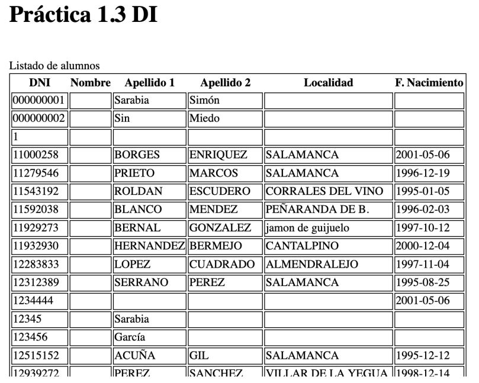

# PRÁCTICA 1. DESARROLLO DE INTERFACES

**Alumno**: Martín Antonio Córdoba Getar
**FPGS Desarrollo de Aplicaciones Multiplataforma. 2º Curso. Desarrollo de Interfaces**

## Procedimiento
El proyecto constará de varias prácticas pequeñas llamadas 1.1, 1.2, ... Para cada práctica
se creará una rama con el nombre practica_1.1, practica_1.2, practica_1.3,... en donde el número
de práctica variará en función de la práctica que estemos realizando. Una vez que hayamos
concluido la práctica se hará un MERGE con la rama MASTER, de tal manera que master siempre
contendrá lo último operativo. Esto no quita para que el alumno cree otras ramas a partir de
la de la práctica si lo considera necesario.

La corrección se hará desde Bitbucket, por lo que se ha de compartir el proyecto.

## Descripción 1.1
Hay que crear un index.php con el que montaremos una tabla dinámica, ayudándonos de los bucles de php,
con la estructura que muestra la tabla:

|Campo 1         |Campo 2         |Campo 3         |Campo 4         |
|----------------|----------------|----------------|----------------|
|Fila 1 Columna 1|Fila 1 Columna 2|Fila 1 Columna 3|Fila 1 Columna 4|

etc... hasta cuatro columnas y 6 filas

Para conseguirlo tendremos que anidar dos bucles, uno para las filas y otro para las columnas.
El número de filas y columnas dependerá de dos variables definidas en la cabecera del documento.

Aunque es un archivo php, su contenido será un documento HTML5 bien formado, con los scripts de
php necesarios insertados en el código.

## Descripción 1.2
Como continuación a la práctica 1.1, vamos a crear un pequeño formulario, en la parte superior de la
página, con dos campos: filas y columnas, y un botón de submit.

Según los datos que pongamos en las casillas, la tabla se redibujará al enviarlos. Tanto en la primera
carga como si los números que nos dan son menores a 1, se pondrán los valores por defecto 2x2.

## Descripción 1.3
En este ejercicio vamos a practicar las conexiones a BD mediante la clase PDO. Para ello vamos a crear
una conexión a la BD universidad y obtener el listado de alumnos de la BD mostrándolo en una tabla,
tal como muestra la imagen.

Lo vamos a hacer en el archivo index de la rama descartando todo el código que teníamos. Como siempre, el documento será un HTML5 bien formado aunque con extensión PHP para embeber nuestros scripts.

De las distintas formas de hacerlo que tenéis en el manual adjunto en moodle, vamos a realizarlo con el método "prepare" ya que aporta robustez, y en un cuanto a la forma de rellenar la tabla se deja a criterio del alumno.

Para no tener problemas con la codificación alfanumérica de la BD tendréis que forzar que la conexión a la BD se haga con UTF-8.